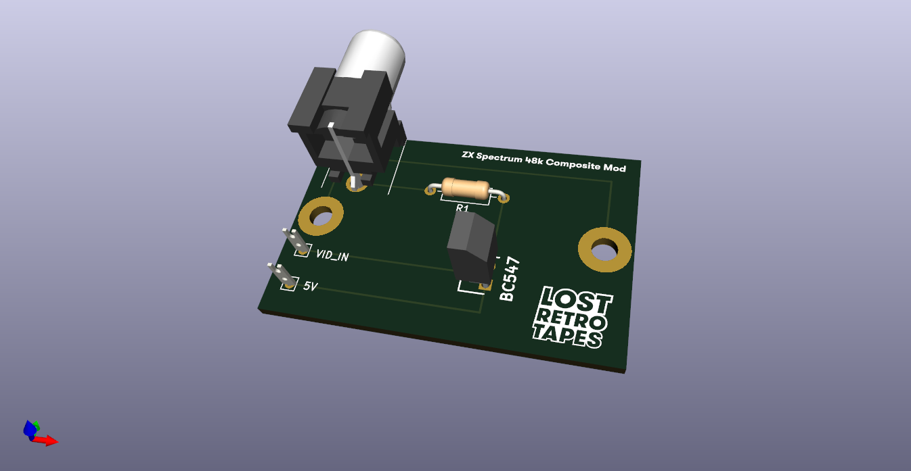

# ZX Spectrum Composite Mod Board For New Builds

This is a work in progress to make a PCB for the composite mod for the new PCBs that won't have the metal casing.

You can see the Spectrum new build series here https://www.lostretrotapes.com/building-a-new-zx-spectrum-from-all-new-parts-mostly-part-1/

